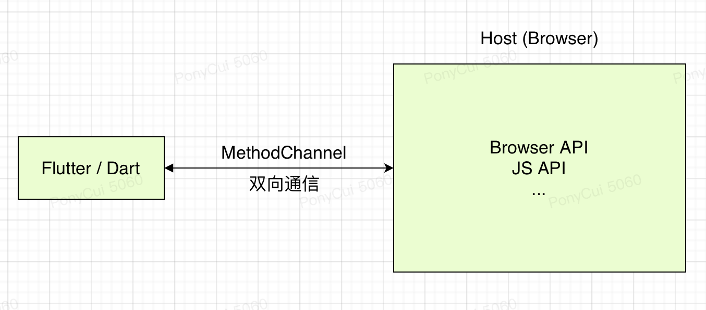
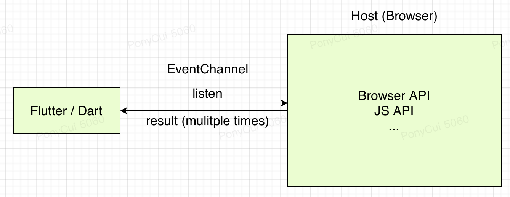

当 MPFlutter 自带的 UI 组件以及 API 不能满足开发者的需要时，开发者可以使用平台扩展的方式，通过 `MethodChannel` / `EventChannel` 调用特定平台能力。

同时，MPFlutter 也支持开发者嵌入特定平台 View (视图)，例如，你可以嵌入某个地图 SDK 的视图到应用内。

## 架构概述

在开始开发平台扩展前，我们先了解一下 MethodChannel / EventChannel 两个通道，以及 MPPlatformView 可扩展视图。

### MethodChannel 

MPFlutter 使用平台通道在客户端（Dart）和宿主（平台）之间传递，如下图所示：

消息和响应以异步的形式进行传递，以确保用户界面能够保持响应。

客户端做方法调用的时候 MethodChannel 会负责响应，从平台一侧来讲，在 JS 之上使用 MethodChannel 来接收和返回来自 MethodChannel 的方法调用。

如果需要，方法调用也可以反向发送，由平台充当客户端来调用 Dart 实现的方法。

MethodChannel 在客户端一侧，主要是调用 invokeMethod 方法，而在 JS 一侧，则是响应 onMethodCall 方法，并返回结果。

你可以在 invokeMethod 中携带任何可以通过 JSON 序列化的参数数据，在 onMethodCall 中可以接收到这些参数。

### EventChannel

EventChannel 是一个可用于持续监听结果的通道，你可以在客户端一侧发起监听，在 JS 一侧发送事件。它与 MethodChannel 最大的区别在于，EventChannel 可以多次、无限制地接收结果。

通道的所有事件都会持续地发送到客户端，直至客户端停止监听。

一个常见的例子是地理位置座标的监听。

### MPPlatformView

MPPlatformView 是一个普通的 Flutter Widget，借助它，你可以将平台视图嵌入到 MPFlutter 应用中。

其原理是通过在平台侧创建一个对应的 View，并将目标视图添加到该 View 中实现的。

在 MPPlatformView 中，可以使用内置的 MethodChannel 进行双向通信。

## 工作准备

下一步，你可以开始为不同的平台添加扩展了，在添加扩展前，你需要安装一些工具，并学习一些知识。

* 如果你需要为 Web 开发平台扩展，你需要在本机先安装 `NodeJS`，学习 `TypeScript`。
* 如果你需要为微信小程序开发平台扩展，你需要在本机先安装微信开发者工具，学习微信小程序中的`自定义组件`知识。

当一切就绪后，请选择左侧菜单中对应的平台，开始第一个扩展的开发吧。
