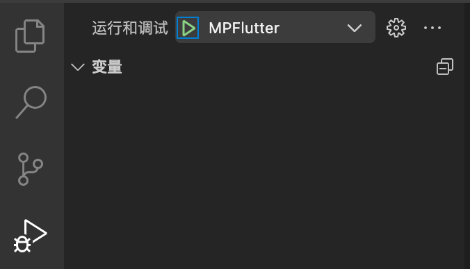
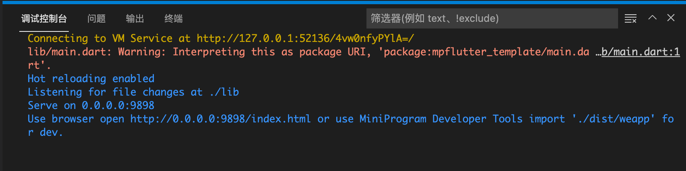
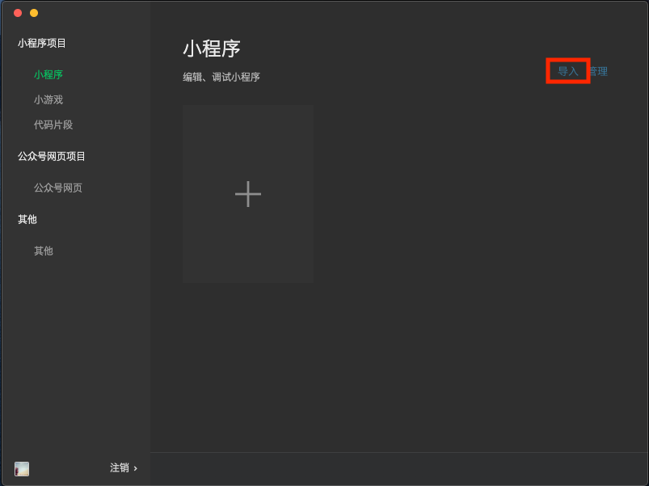
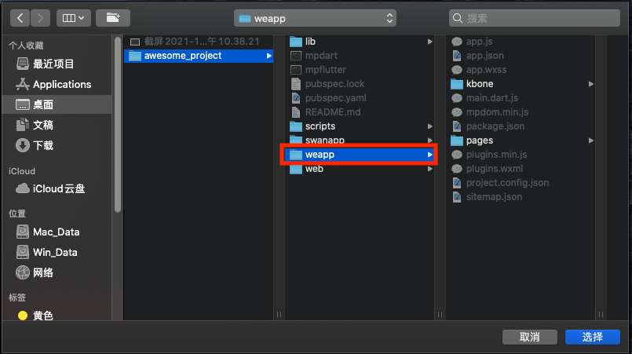
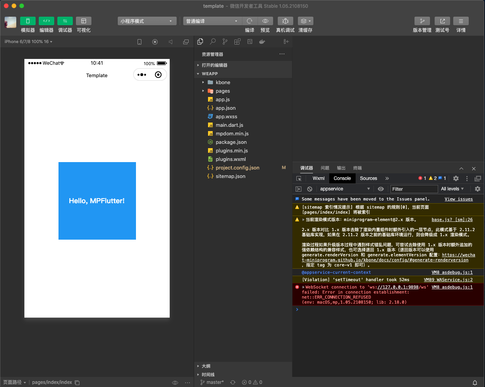
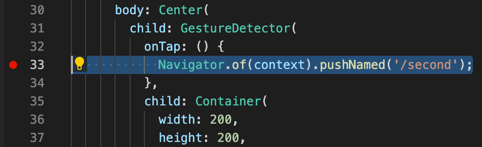
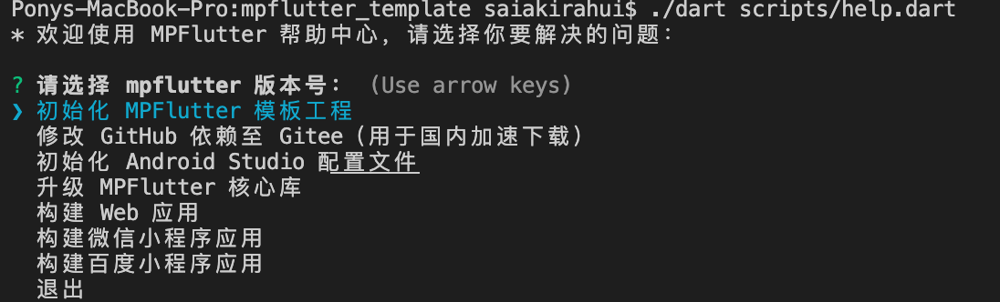

使用 MPFlutter 可以轻松开发各类小程序，这里以微信小程序为例，讲述如何从零开始创建一个小程序工程，并构建、上传至微信服务器。

你需要先安装好[『微信开发者工具』](https://developers.weixin.qq.com/miniprogram/dev/devtools/download.html)，如果需要真机调试，还需要申请测试帐号或申请正式小程序 AppID。

## 克隆模板工程

使用命令行，通过 `git clone` 方式克隆模板工程至目标目录，例如 awesome_project。

```sh
git clone https://github.com/mpflutter/mpflutter_template.git awesome_project
```

> 我们提供 gitee 镜像，当遇到网络问题时，可以将 github.com 替换成 gitee.com 即可。

## 安装依赖

使用 VSCode 打开刚刚克隆得到的工程根目录，在命令行中执行以下命令。

```sh
./mpdart pub get
```

> 注意，这里用的是 `./mpdart` 而不是 `dart`！

## 运行应用

保持在 VSCode 窗口中，按下键盘【F5】键（也可以使用鼠标点开调试栏启动调试），开始调试。



稍等片刻，调试控制台中会出现以下信息（如果没有出现该信息，请重新启动调试）。



此时，使用『微信开发者工具』导入工程根目录下的 weapp 目录。





在开发者工具导入成功后，打开该工程，正常情况下将出现以下画面。



## 尝试热重载

MPFlutter 通过 热重载 提供快速开发周期，该功能支持应用程序在运行状态下重载代码而无需重新启动应用程序或者丢失程序运行状态。修改一下代码，然后告诉IDE或者命令行工具你需要热重载，然后看一下模拟器或者设备上应用的变化

1. 打开 `lib/main.dart`。

2. 修改字符串

`
'Hello, MPFlutter!'
`
改为

`
'Hello, World!'
`

3. 不要 停止应用。保持应用处于运行状态。

保存修改

你会发现修改后的字符串几乎马上出现在正在运行的微信开发者工具上。

## 尝试断点

1. 打开 `lib/main.dart`。

2. 在第 33 行处，添加断点，如下图。



3. 在微信开发者工具中，点击『蓝色区域』，此时，VSCode 会收到断点信息，并停留在断点处，你可以尝试在此进行断点调试。

## 真机调试

你需要修改 `weapp/app.js` 文件，将其中的 `127.0.0.1` 替换为你的电脑局域网 IP。

然后使用微信开发者工具的『真机调试』或『预览』功能实现开发调试。

## 初始化应用信息

停止调试，并切换到终端命令行，执行以下命令。

`
./mpdart scripts/help.dart
`

这将出现以下信息，`help.dart` 是 MPFlutter 的帮助中心，可帮助你完成应用的初始化和构建工作。



我们选择`初始化 MPFlutter 模板工程`，并根据提示输入工程名称、输出目标。

* 是否移除模板工程自带的 Git 源？ (y/N)

    * 对于新克隆的模板工程，选 y 即可，移除自带的 Git 源，后续可以添加自己的 Git 源。

* 请输入工程名称，合法字符为全小写英文和下划线：

    * 输入一个合法的工程名称，如 `awesome_project`，这将会同步修改 `pubspec.yaml` 中的 `name` 值。

* 该工程需要输出到 Web 吗？(如果选择否，将删除 Web 目录。) (y/N)

    * 如果你不需要输出到 Web (HTML5) 可以选择否，一般情况下，我们会选 y 保留该目标。

* 该工程需要输出到微信小程序吗？(如果选择否，将删除 weapp 目录。) (y/N) 

    * 选择是。

......

在命令行执行 `./mpdart pub get`。

## 构建产物

当开发完成后，你可以通过以下命令构建微信小程序产物。

`
./mpdart scripts/build_weapp.dart
`

构建完成后，产物位于 `build` 目录下。

## 预览、上传产物

使用微信开发者工具，导入 `build` 目录，即可预览构建后的应用，并上传至微信服务器。

## 了解更多

* [通过 MPFlutter 调用微信小程序 API](./weapp-api)
