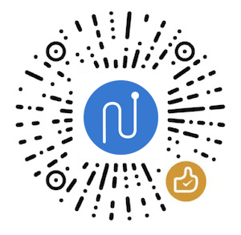

MPFlutter 的发展离不开社区的支持和反馈，我们很乐意在 GitHub 和微信上回复开发者的问题。

我们也希望能收到您的反馈，如果您已经通过 MPFlutter 框架开发完成应用，并已上线到正式环境，我们恳请您能通过以下方式支持 MPFlutter。

## 案例征集

您可以通过到 GitHub 上提 Issue 的方式，告知我们你的产品或公司名称，并决定是否授权我们在 mpflutter.com 展示贵司、贵产品的 Logo 以作为案例。

请使用以下模板提交 Issue

标题：【案例展示】XXX （公司、产品）使用 MPFlutter 完成了 XXX 功能并已上线

内容：

1. 使用 MPFlutter 用于哪个场景的发布（微信小程序、Web）；
2. 选择 MPFlutter 的技术考量因素；
3. 简单阐述使用 MPFlutter 过程中遇到的问题、解决方式；
4. 公司、产品的名称以及 Logo，以及是否愿意将其展示到 MPFlutter 站点，并在此授权我们使用相关信息。

当然，您也可以通过匿名的方式，隐去产品和公司信息，提交 Issue。

## 在掘金、微信公众号等渠道发表文章

我们鼓励开发者撰写技术文章并发布到掘金、微信公众号等平台，文章类型不限于教程、开发指南、经验分享等。

一旦文章得到平台推荐，我们将在重要日子通过回赠礼物的方式感谢作者。

您在相关平台发布文章后可以通过到 GitHub 提交 Issue 的方式告知我们。

请使用以下模板提交 Issue

标题：【文章分享】文章标题

内容：

文章内容、作者。

并添加 ponycui 微信作进一步沟通交流。

## 捐赠

当前，MPFlutter 是由 PonyCui 主导的开源项目，并未受任何公司控制。

MPFlutter 将坚持以下原则：

- 核心代码不作任何保留，完全公开。
- 核心代码问题会在一周内回复，最迟不超过一个月解决，一般会随版本发布更新。
- 核心代码保持非盈利性质。

正因如此，MPFlutter 开发组需要社区在物质上的支持。你可以通过以下方式成为赞助商支持我们。

### 一次性赞助

您可以通过微信赞赏的方式进行一次性赞助，您可以在赞助中备注您的昵称，一次性赞助超过 50 元的朋友，将展示在此处。

> 感谢这些朋友的支持：[badboy-tian](https://github.com/badboy-tian)、Jackie

### 顶级赞助

您可以通过微信、支付宝转帐等方式赞助 MPFlutter，具体操作方式可以联系 ponycui 微信沟通，我们可以通过以下方式回报你的赞助。

- 在指定时间内，在 MPFlutter 文档站悬挂贵司（或产品）的 Logo 并添加链接。
- 在此文档页长期展示您的信息（按捐赠时间、金额排序）。
- 可以邀请作者通过在线、当面的方式开展技术交流活动（差旅费用另计）。

---

如果你是企业经营者并且将 MPFlutter 用在商业产品中，那么赞助 MPFlutter 有商业上的益处：可以让你的产品所依赖的框架保持健康并得到积极的维护，也能帮助你在 MPFlutter 社区里获得更高的曝光度。

如果你是个人开发者并且享受 MPFlutter 带来的高开发效率，可以用捐助来表示你的谢意 —— 就好像偶尔给我买杯咖啡 :)

