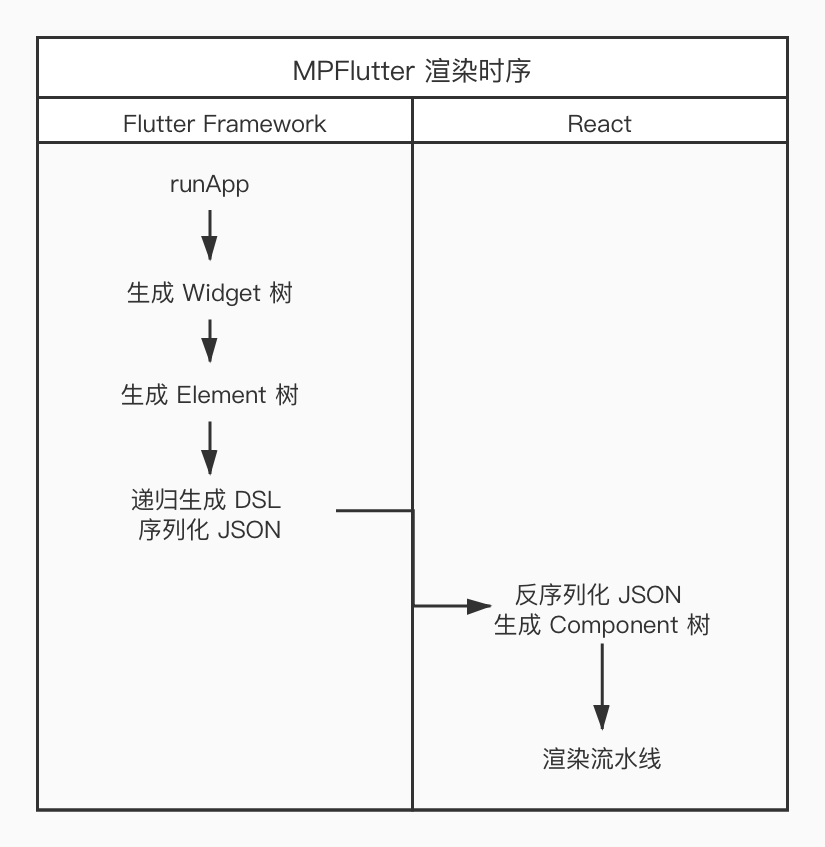

在 `MPFlutter` 面世以前，`Flutter` 官方、社区已有不少动态化、WebApp 方案，本文将着重阐述 `MPFlutter` 与主流方案的异同点。

我们将与以下方案作对比：

- FFW（官方方案）
- MXFlutter
- areslabs/flutter_mp

## FFW

`Flutter` 官方于 2019 年发布 `Flutter For Web`（以下简称 `FFW` ）开发者预览版，并于 2021 年发布稳定版，宣告 `FFW` 正式进入生产环境可用阶段，本节将具体阐述 `MPFlutter` 与 `FFW` 的异同。

`MPFlutter` 和 `FFW` 有以下相似之处。

- 使用 `Dart` 开发，最终运行产物均为 `JavaScript`。
- 编译时均使用 `dart2js` 构建产物。
- 开发阶段，均支持 `Hot-Reload` `Hot-Restart` 等特性。

`MPFlutter` 与官方 `FFW` 方案，同宗同源，可以认为 `MPFlutter` 是 `FFW` 的精简版，去除不必要的 `Material` 组件，保留最适合 `WebApp` 使用的布局、内容、交互组件。

下列章节，将从不同角度分析两个方案的区别。

### 基础产物大小

两者最终产物均为 JavaScript，`FFW` 在 DomCanvas 下已集成运行时，而 `MPFlutter` 还需要加上对应 `Runtime` 的运行时。

使用同一 Demo 情况下（Scaffold + Text + Container），对比产物大小。

| 方案 | 产物大小 | gzip   |
| --- | ---     | ---    |
| FFW        |  2.1M   |  486K  |
| MPFlutter  |  692K   |  201K  |

> 使用 Flutter 2.0.2 构建，移除不必要的字体、资源文件后统计得出。

* FFW 使用完整的 Material 组件，会带入非常可观的包大小。
* MPFlutter 使用精简的组件包，移除 Render 流程代码，极限压缩 dart2js 产物大小。

### 渲染方法

`FFW` 是基于 `DomCanvas` 或 `WebGL` 渲染内容的。`DomCanvas` 兼容性较好，但性能很弱；`WebGL` 性能较好，但兼容性、文本处理能力稍弱。无论是 `DomCanvas` 或是 `WebGL`，在移动端上的表现都不理想，尤其在 `Android` 机器上性能表现更为糟糕。`FFW` 方案似乎更多地是为非移动设备而设计的。

可以用以下时序图理解 `FFW DomCanvas` 方案：

> `FFW WebGL` 方案与 `DomCanvas` 方案类似，区别在于 `创建 DOM 对象` 这一步，替换成 `SkiaObject`，使用 `Skia WASM` 配合 `WebGL` 渲染视图。


`MPFlutter` 是基于 `DSL` 描述视图，并基于传统的 `React` + `DOM` 渲染内容的。`MPFlutter` 会在每次视图更新后，递归整个 `Element` 树，并序列化为 `JSON`，`React` 会反序列化 `JSON`，并使用对应的 `Component` 渲染组件。

可以用以下时序图理解 `MPFlutter` 方案：


Q: 我们是否需要把所有的 Flutter 组件都作一遍映射？

A: 答案是，不需要，只有约 [20 个组件](https://github.com/mpflutter/mpcore/tree/master/lib/components) 需要作映射。

Q: 这么做带来的好处是什么？

A: 可以减少 DOM 通道传输压力；可以最大程度复用 `Flutter` 的布局、组件能力；可做动态化，DSL 是一致的、简单的，只需要在 小程序、iOS、Android 等生态，编写相应运行时，即可运行 `MPFlutter`。

Q: 这么做有什么缺点？

A: 由于使用的是精简版本 Flutter Widgets，失去了 `Write Once, Run Anywhere` 的能力，只能保证 `Learn Once, Run Anywhere`，我们认为，WebApp 是需要作定制化、精简化的。

### 运行时性能

#### FFW

`FFW` 性能并不如众人所愿，尤其在移动端上卡顿明显，即使使用当前最先进的 Android 设备，在滑动时也会感觉到明显丢帧，在 iOS 上性能会好很多。WebGL 方案在移动端上似乎不太可行，一方面受设备性能限制，WebGL 不能发挥全部能力，另一方面，受制于 Android 系统碎片化严重，兼容性存在问题。

我们具体分析一下，`FFW` 性能为什么有问题。

`FFW` 其设计思路是尽可能复用 `Flutter Framework` 能力，尽可能使 WebApp 做到平台无关，以下能力是 `FFW` 在 Framework 层面实现的：

- 布局
- 触摸（点击、滚动、页面滚动、双击等）
- 文本排版
- 层合成
- Canvas

这种思路本质上是把 DOM 作为 Canvas 使用，比如我们需要画一个红色矩形，会生成类似以下的 HTML 代码。

```html
<body>
    <div style="width: 44px; height: 44px; backgroud-color: red"></div>
</body>
```

所有 DOM 的布局均由 Flutter 计算，并通过 `style` 修改而成。

同样的，所有 DOM 的触摸事件（其实就只是 body 的触摸事件），都会被 `Flutter Framework` 截获，并处理。

层合成、文本排版、Canvas 也是如此，值得一提的是『文本排版』，在浏览器 `JavaScript` 层面，我们是无法直接操纵文本排版计算的，只能通过曲线救国的方式，使用不可见的 DOM 进行计算（也可以通过 Canvas::measureText 曲线救国），正是这一点导致 `FFW` 性能变得糟糕。

可以想象，快速滑动的同时，需要修改 DOM 属性，同时还需要进行『文本排版』，其性能会有多糟糕。

#### MPFlutter

`MPFlutter` 性能会比 `FFW` 好很多，其设计的思路是以空间换时间。同样是使用 Flutter 进行布局、文本排版、层合成，`MPFlutter` 会一次性地把整个页面序列化、生成 DOM，同时把触摸的控制权交还给浏览器，仅保留点击事件回调。

可以理解为，一次性渲染一整个页面，在滑动过程中，毋需 `Flutter Framework` 再作介入。

> 我们在生产环境上，使用 MPFlutter 开发的 WebApp 可以达到 60 FPS，即便是低端的 Android 机也能达到 50 以上。

### 开发体验

`FFW` 支持使用 VSCode 开发应用，使用 Chrome 结合 `webdev`，可以实现断点调试，但不支持 `Hot-Reload`。

`MPFlutter` 支持使用 VSCode 开发应用，结合 `WebSocket` 可以实现断点调试，支持 `Hot-Reload` ，其开发体验与常规的 `Flutter` 应用并无区别。

在编译工具上，`MPFlutter` 提供专有的命令行工具，可以方便地构建 WebApp 流水线。

## MXFlutter

`MXFlutter` 是腾讯开源的 `Flutter` 动态化框架，可以使用 `JavaScript/TypeScript` 开发 `Flutter` 应用，在原理上是与 `MPFlutter` 类似的。

不同的是，`MXFlutter` 思路是使用 `JavaScript` 开发 `Flutter` 应用，`MPFlutter` 是使用 `Dart` 开发 `WebApp` 应用。

## areslabs/flutter_mp

[flutter_mp](https://github.com/areslabs/flutter_mp) 是京东 areslabs 团队的研究产物，是一个半成品，MPFlutter 借鉴了部分思路，感谢 areslabs 的分享。